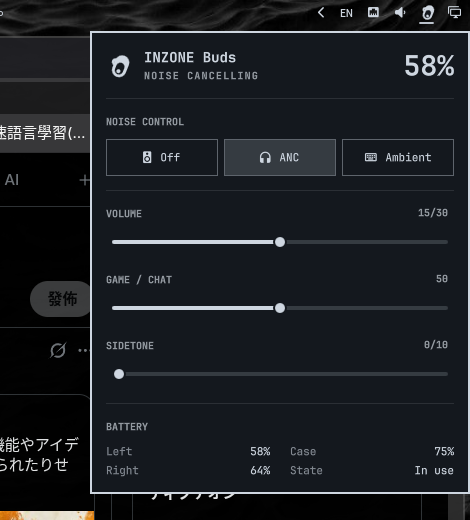

# Omarchy INZONE Buds

Bar widget for [Omarchy](https://omarchy.org/) that controls Sony INZONE Buds through [zoneout](https://github.com/marcinjakubowski/zoneout).

ANC, hardware volume, game/chat mix, sidetone, and L/R/case battery.



## Install

```sh
omarchy plugin add https://github.com/kazedayo/omarchy-inzone-buds.git --enable
```

Place it:

```sh
omarchy bar move io.github.kaz.omarchy-inzone-buds --section right
```

## Usage

- Left click: open the panel
- Right click: cycle ANC (Off → NC → Ambient)
- Arrow keys in the panel: cycle ANC
- Escape: close

Snapshot on start and on panel open. Settings writes are optimistic (`zoneout --set`). Adaptive polling: every 10 s while connected (battery), every 3 s while disconnected (reconnect detection).

## Dependencies

Does not install these. You need them on the host:

- Omarchy (`omarchy-shell`)
- [zoneout](https://github.com/marcinjakubowski/zoneout) on `PATH` or at `~/.local/bin/zoneout`
- `hidapi` (and Python `hid` bindings)
- USB dongle for INZONE Buds (`054c:0ec2`)
- udev access to the dongle’s hidraw node (zoneout’s `99-zoneout.rules`)

Hardware EQ is not available: zoneout has no EQ packets.

## Remove

```sh
omarchy plugin remove io.github.kaz.omarchy-inzone-buds
```

Does not uninstall zoneout or udev rules.

## License

MIT. See [LICENSE](LICENSE).
